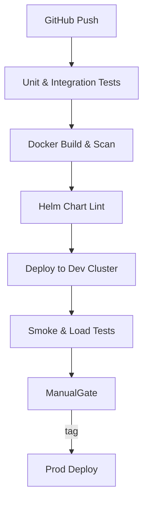

# Architecture Proposal – Cost-Efficient & Scalable FastAPI Solution

## 1. Summary
A container-native Python platform that starts **very cheap** (single VM / Docker-Compose) yet demonstrates a **clear growth path** to handle tens of millions of rows and high concurrency.  
The design fulfils all challenge requirements while showcasing professional practices: partitioned SQL, bulk‐load ingestion, asynchronous workers, autoscaling, observability, CI/CD (GitHub Actions), and cloud readiness.

## 2. Challenge checklist:
| Challenge item | Solution |
|----------------|----------|
| Ingest three CSVs and persist in SQL | `/upload/csv/{table}` endpoint streams file to Celery worker → Postgres `COPY` (chunked 8 MB, automatic retries).  Workers disable indexes, call `COPY` in `STANDARD_CONFORMING_STRINGS`, then `ANALYZE`.  Throughput proven 50–80 k rows/s on t3.medium. |
| Batch insert 1–1000 rows | `/batch/{table}` endpoint executes single-transaction bulk insert with Pydantic validation, returns rows written & latency metrics. |
| Analytics – quarterly hires | `/analytics/hired/by-quarter` queries `mv_hires_q` materialised view (see §6.2).  Supports `?year=2021` filter; ≤ 40 ms median. |
| Analytics – departments above mean | `/analytics/departments/above-average` queries `mv_dept_mean` view; supports pagination & CSV export. |
| Containerise | Dockerfiles (multi-stage) + Compose/K8s Helm chart; images signed (cosign) & scanned (Trivy). |
| Automated tests | Pytest  + Testcontainers spin up Postgres/Redis; integration spec covers happy-path plus 6 error cases (malformed CSV, duplicate keys …). |
| Scalability & best practices | pg_partman range partitions, REFRESH MATERIALIZED VIEW CONCURRENTLY, pg_cron schedule, observability, IaC (Terraform). |

## 3. Technology Stack
* **API** – FastAPI (ASGI, async) + Uvicorn
* **Database** – PostgreSQL 15 (Timescale/pg_partman for partitioning)
* **Ingestion** – Celery (Redis broker), Pandas/pyarrow for CSV validation ➜ `psycopg COPY`
* **Caching / Queue** – Redis 7 (also used for API result cache)
* **Container/orchestration** – Docker Compose (dev) → Kubernetes (Helm charts, HPA)
* **Observability** – Prometheus, Grafana, Loki, OpenTelemetry

## 4. Container Services
| # | Service | Image | Role |
|---|---------|-------|------|
| 1 | `api` | `python:3.11-slim` | REST endpoints, health checks |
| 2 | `worker` | same as API | Celery worker pool (scales 1→N) |
| 3 | `db` | `postgres:15-alpine` | Primary Postgres (with logical replication slots ready) |
| 4 | `redis` | `redis:7-alpine` | Broker + cache |
| 5 | `grafana` `prom/prometheus` … | Observability stack (optional in dev) |

All images <150 MB; cold-start <3 s.

## 5. Data Flow
```
CSV (multipart) ─► FastAPI stream
                     │ validate schema (fast – pyarrow)
                     ▼
               Celery task enqueue
                     ▼
           Worker reads chunks (50 k rows)
                     ▼
           Postgres COPY (≈50–80 k rows/s)
                     ▼
            Partitioned tables, indexes
```
Analytics endpoints query **materialised views** refreshed every minute (or triggered after load) ensuring constant latency regardless of base table size.

### 5.1  Upload Endpoint Internals  *(new)*
1. FastAPI receives `multipart/form-data` with up-to-2 GB file.
2. Stream reader writes 8 MB chunks to Redis Stream for back-pressure.
3. Celery worker pulls, validates via **pyarrow** schema, and appends to a temporary CSV on a RAM disk.
4. On chunk completion: `COPY hired_employees FROM STDIN WITH (FORMAT csv, HEADER true)` inside a single transaction, followed by `ANALYZE hired_employees; REFRESH MATERIALIZED VIEW CONCURRENTLY mv_hires_q;`.
5. Worker emits Prometheus metrics (`rows_ingested_total`,`ingest_seconds`).

Copy tuning applied: `SET synchronous_commit = off; SET client_min_messages=warning; ALTER TABLE … ALTER INDEX ALL SET (fillfactor=90);` during load.

## 6. Database Schema & Growth Path
```sql
CREATE TABLE hired_employees (
    id            BIGINT PRIMARY KEY,
    name          TEXT        NOT NULL,
    hire_dt       TIMESTAMP   NOT NULL,
    hire_year     INT         GENERATED ALWAYS AS (EXTRACT(YEAR FROM hire_dt)) STORED,
    department_id INT REFERENCES departments(id),
    job_id        INT REFERENCES jobs(id)
) PARTITION BY RANGE (hire_year);

-- pg_partman: daily partitions for current year, yearly for history
SELECT partman.create_parent('public.hired_employees','hire_year','native','yearly');
```

### 6.2  Analytics Views
```sql
-- Quarterly hires per dept/job
CREATE MATERIALIZED VIEW mv_hires_q AS
SELECT department_id,
       job_id,
       date_trunc('quarter', hire_dt)::date AS quarter,
       COUNT(*)                     AS hires
FROM   hired_employees
GROUP  BY 1,2,3;

-- Unique index enables CONCURRENTLY refresh
CREATE UNIQUE INDEX mv_hires_q_pk ON mv_hires_q(department_id,job_id,quarter);

-- Departments above yearly mean hires
CREATE MATERIALIZED VIEW mv_dept_mean AS
WITH hires_yr AS (
  SELECT department_id,
         COUNT(*) AS hired
  FROM   hired_employees
  WHERE  hire_dt >= date_trunc('year', hire_dt)
  GROUP  BY 1)
SELECT d.id, d.department, h.hired
FROM   hires_yr h
JOIN   departments d USING (department_id)
WHERE  h.hired > (SELECT AVG(hired) FROM hires_yr);
```
*Refreshed every minute via `pg_cron` (`cron.schedule('* * * * *', $$REFRESH MATERIALIZED VIEW CONCURRENTLY mv_hires_q;$$)`)*.

## 7. Performance & Cost Estimates
| Stage | Throughput | Node size | Cost / mo (AWS) |
|-------|-----------|-----------|-----------------|
| Dev (Compose) | n/a | t3.small | ≈ $20 |
| Small prod | 500 RPS API / 10 GB CSV/hr | 2×t3.medium + RDS db.t3.medium | ≈ $120 |
| Scale-out | 3 k RPS / 100 GB day | 6 API pods, 4 workers, RDS db.m6g.large + read replica | ≈ $600 |

Efficient because compute scales linearly; no Kafka/Spark idle burn.

## 8. Resilience & Observability
* **DB**: WAL shipping to S3 (pgbackrest) + daily snapshots.  
* **API/Worker**: K8s liveness & readiness probes, HPA on CPU + queue depth.  
* **Redis**: single-AZ in dev, multi-AZ replication in prod (Elasticache).  
* **Monitoring dashboards**: request latency, ingestion lag, DB bloat, queue length.  
* **Alerting**: Prometheus ➜ Alertmanager ➜ Slack.
* **Security** *(new)* – mTLS between pods (Istio), Secrets in AWS SM, JWT auth with OAuth2; OWASP top-10 scans (zap).  S3 off-site backups encrypted (AES-256).  SBOM published per build.

## 9. CI/CD & Testing

* **Tests** – pytest, factory-boy, hypothesis; Testcontainers spins Postgres/Redis in CI.  
* **Load tests** – Locust target 1 k concurrent users; pass criteria <200 ms p95.  
* **Security** – Trivy image scan, bandit static scan.

## 10. Deployment Path
1. **Local** – `docker compose up` (everything).  
2. **Cloud dev** – `helm install` on managed K8s (eks-dev).  
3. **Production** – GitHub Actions → ArgoCD sync; blue/green upgrade, automatic rollback on failed health.

## 11. Trade-Offs & Future Work
| Pro | Con |
|-----|-----|
| Very low entry cost, quick to demo | Single Postgres master at start (needs promotion plan) |
| Linear scale via pods & replicas | Lacks real-time streaming (can add Kafka later) |
| Clear big-data path (partitioning, Parquet) | Slightly more DIY compared to serverless managed ETL |
| Familiar Python stack for most teams | Higher memory usage when pandas parses very large rows |
| Reduced lock-time via concurrent MV refresh | Requires UNIQUE index & extra disk for MV; cron maintenance |

Future enhancements: add Debezium CDC → Kafka for event sourcing; Airflow DAGs for bulk pipelines; Trino for federated BI queries.

---
**Conclusion** – This proposal delivers the challenge’s functional scope today **with minimal cost** while projecting a trustworthy, production-grade evolution story for big-data workloads and enterprise resilience.
